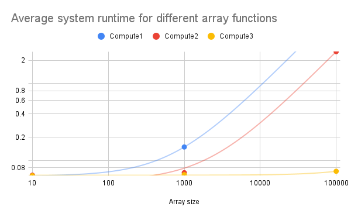
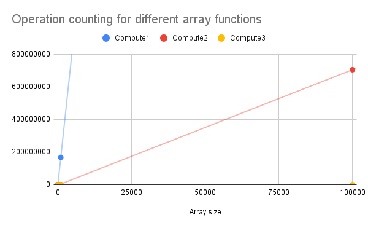

# Speed Reader

## About

This project is a speed reader that displays one word at a time to increase reading speed.
Also includes: Semantic Mysteries lab from Monday and Empirical Complexity lab from Friday.

### Authors

*  El Houston
*  Oscar To

### Resources

*   Class lab page: https://osera.cs.grinnell.edu/ttap/data-structures-labs/speed-reader.html 
*   Java scanner class: https://www.w3schools.com/java/java_user_input.asp 
*   `DrawingPanel.java` adapted from _[Building Java Programs](https://www.buildingjavaprograms.com/) by Reges and Stepp.
*   VSCode
*   Maven compiler 0.45.1

## Write-up

### Semantic Mysteries

#### Problem 1.1

What is the difference in calling the following three change methods, and why is this the case?

The difference between the three change methods are what they take in as params and what they actually do in practice. 
change1 takes an int x as a param, and changes the value of x to 5. change2 takes a cell object as a param, and changes its
x field (property) to 5, while change3 takes a cell object as param, sets x field to 5, but then resets the cell by making it a 
new cell object. 

What’s the rule here? Does java pass parameters by value (i.e., copy) or by reference? Is passing an object (with an arbitrary number of fields) to a function more costly than passing a primitive?

Java passes by value. Passing an object is more costly than passing a primitive (more fields), but just passing the value doesn't work because you aren't passing the actual field. If you pass an object it still passes by value, but it passes a copy of the pointer to the object.

#### Problem 1.2

What is the this variable in a method, and where does it come from? How do these four classes differ with respect to their increment methods?

This variable in a method is a self-referencial variable that refers to the object that was accessed when the method was called. Counter1's increment takes no params, and it's incrementing an arbitrary value. Counter2's increment takes in a value as a param, and doubles the parameter, not the object value. Counter3 takes in an int value, and adds the parameter to the object value. Counter4 takes in an int value, and increments the parameter with the object value. Only Counter1 and Counter3 work as they are supposed to.

What’s the rule for variable look-up in Java? How does this differ from function calls in C?

Scope. Variable look-up in Java is dependent on the scope of the look-up function—it's dependent on what the function has 
access to (public vs private).

#### Problem 1.3

What is the distinction between a static and non-static member (i.e., field or method)? In particular, imagine using this variant of a counter. Why does this (first) code not work? How do you fix it?

If value is static, it belongs to the whole class and not a specific object, which means you can't use `this`. To fix it, make the int `value` non-static so that the increment method can be called on a new Counter object.

In general, what is the rule for mixing static and non-static things? Does this (second) code work? Why or why not?

You can't make a static reference to a non-static method or variable. The second code doesn't work because the printGreeting method is non-static, meaning it needs an object to access it and there isn't an object.

#### Problem 1.4

Does the following code snippet behave as you expect? Why? How do you fix its behavior?

It doesn't. I'd expect the equality operator to work, since both are set to 0, but since they're comparing objects, it won't work. We can fix its behaviour by comparing c1.value and c2.value instead.

With this in mind, does this code behave as you expect?

Yes. They're comparing references to string literals, which are the same. When you declare a new immutable string, it checks the string pool for an equivalent value, and makes the reference values equal. This has been shown earlier.  

How about this snippet? What’s the difference between these two snippets and why?

The second snippet doesn't work because the scanner doesn't use the string pool, so each time the scanner is used, the string is given its own reference value. Since (s3 == s4) is checking for reference equality, not value, it won't work.

#### Problem 2.1

(always: ✓, sometimes: ?, never: ✗)

*   Point A:
    + `x1 == 0`: ?
    + `x2 < 0`: ?
*   Point B:
    + `x1 == 0`: ?
    + `x2 < 0`: ✗
*   Point C:
    + `y1 < 5`: ?
    + `y2 > 0`: ✓
*   Point D:
    + `z > y1`: ?
    + `z < 0`: ✗

#### Problem 2.2

(always: ✓, sometimes: ?, never: ✗)

|         | `s.length >= 2` | `ret.length() > 0` | `ret.length() % 2 == 0`
| ------- | --------------- | ------------------ | -----------------------|
| Point A |        ?        |        ✗          |            ✓           |
| Point B |        ✓        |        X          |            ✓           |
| Point C |        ?        |        ?          |           ✓            |
| Point D |        ?        |        ✓          |          ✓             |
| Point E |        X        |         ✓         |           ✓            |

### Empirical Complexity Analysis

How accurate is the operation counting method of measuring time complexity compared to the wall-clock method for understanding how the time complexity scales with the size of the input?

Measuring time complexity seems more accurate. The operation counting method puts it on a linear scale, but the array access gets much bigger with the size of the array and the data isn't as easy to look at on a graph. The time complexity measurement uses a log scale and you can see the differences between the functions more easily. Compute1 does not return a value if the array is too big because it takes too long. Compute2 has a typical scale, and Compute3 takes around the same number of time regardless of array size.

Graphs:

### Usability Testing
Training texts:

Bee movie script: https://www.google.com/url?sa=t&source=web&rct=j&opi=89978449&url=https://gist.github.com/MattIPv4/045239bc27b16b2bcf7a3a9a4648c08a&ved=2ahUKEwis0Keop8-SAxXsvokEHR1MKk4QFnoECAwQAQ&usg=AOvVaw3v_ddlANg4L7M5co0WX_30
The first two paragraphs of "From C to java" (please find this funny): https://osera.cs.grinnell.edu/ttap/data-structures/from-c-to-java.html 
Wikipedia article on the first crusade: https://en.wikipedia.org/wiki/First_Crusade
Britannica article about world war 1: https://www.britannica.com/video/Overview-start-details-World-War-I-assassination-June-28-1914/-191716 

Question texts:
Participant: Paul Spang (spangpau@grinnell.edu)

Antarctic.txt (Text editor)
Source: Intro from "Heart of the Antarctic" by Ernest Shackleton
1. Name one of the reasons men go to the "void spaces of the world".
Little voice in their head (Correct)
2. How could you be able to tell that this passage is about Antarctica?
References to cold, southern expanse, polar (Correct)
3. What is the name of the expedition that was mentioned?
Discovery (Correct)
4. What was the farthest latitude south reached?
87 15 (Wrong)
5. What is the "mystery" the author talks about at the end of the passage?
The Barrier (Correct)

Passage 2.txt (Speed reader- 500)
Source: Passage from the book Kane and Abel by Jeffrey Archer
1. What is the main conflict in this passage?
The main character got kicked off the board of the bank (Correct)
2. What was the outcome of the conflict? (Give numbers)
He lost 17-12 (Correct)
3. What can you infer about this character based on his interactions with his doorman?
No idea (Wrong)
4. What did the character lose?
His job as chairman of the bank (Correct)
5. How does the character feel about this?
He feels like he lost everything, almost suicidal (Correct)

winterolympics.txt (Speed reader- 350)
Source: https://www.britannica.com/sports/Winter-Olympic-Games
1. What year was the first Winter Olympics?
1924 (Correct)
2. Where are the 2026 Winter Olympics being held?
Milano Cortina (Correct)
3. What was the only sport women participated in in the first Winter Olympics?
Skating (Correct)
4. What percentage of athletes in the 2026 Olympic Games are female?
47 percent (Correct)
5. True or false? There are over ten times more athletes in this year's games than in the first one.
True (Correct)

Passage1.txt (Speed reader- 250)
Source: Passage from the book Kane and Abel by Jeffrey Archer
1. What is the main event happening in the passage?
Birth of a father's son (Correct)
2. Where was the earthquake that killed those people?
San Francisco (Correct)
3. Who is the character the narration is following (as in what industry/his standing/relevance to the setting)
President of a bank who will build a new hospital wing, so relevant to the hospital (Correct)
4. How does the character feel about the event happening?
He is nervous (Correct)
5. Why does the character feel this way?
Because he's worried it might not be a boy (Correct)

Did your participants demonstrate that they were able to comprehend what they were reading with your speed reader?
Yes. He got 18 out of 20 total questions (90 percent). One wrong answer was in the text editor, and the other one was from the 500 WPM reading, so the texts were mostly comprehensible regardless of speed. He somewhat struggled with getting used to the 500 WPM one, but his comprehension remained high.
